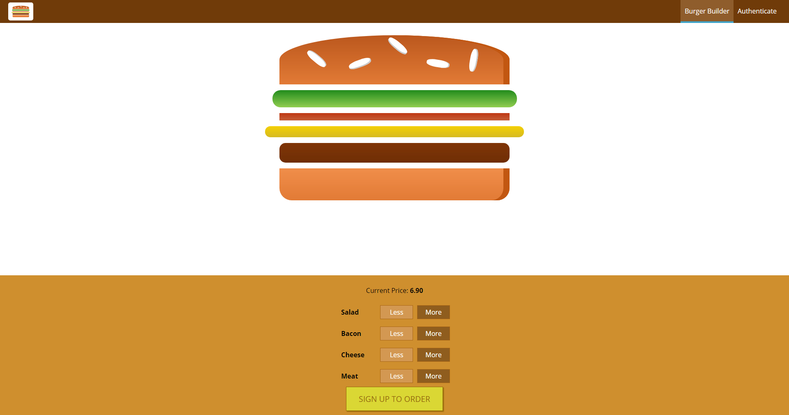

# :hamburger: Burguer Builder
The **Burguer Builder** is a website that allows people build sandwich with 4 differents ingredients: bacon :bacon:, cheese :cheese:, meat :cut_of_meat: and salad :green_salad:.

# :hammer: Dependencies
- [react](https://reactjs.org/)
- [react-hooks](https://reactjs.org/)
- [redux](https://www.npmjs.com/package/redux)
- [redux-thunk](https://www.npmjs.com/package/redux-thunk)
- [axios](https://www.npmjs.com/package/axios)
- [react-router-dom](https://www.npmjs.com/package/react-router-dom)

# :link: Dev Dependencies
- [enzyme](https://www.npmjs.com/package/enzyme)
- [jest](https://www.npmjs.com/package/jest)
- [react-test-renderer](https://www.npmjs.com/package/react-test-renderer)

# :gear: APIs
- [firebase](https://firebase.google.com/)

# :checkered_flag: Getting started
Create `.env` in the root folder and paste the code below to setup the project:
```
REACT_APP_FIREBASE_URL=YOUR FIREBASE URL
REACT_APP_FIREBASE_API_KEY=YOUR FIREBASE API KEY
REACT_APP_FIREBASE_AUTH_URL=https://identitytoolkit.googleapis.com/v1/accounts:
```

# :memo: License
- [MIT license](https://opensource.org/licenses/MIT)